# Databricks - ELT Pipeline

This project implements a complete ELT (Extract, Load, Transform) pipeline using Databricks and the Medallion Architecture to process, clean, and analyze U.S. flight data for the year 2024. The goal is to build a production-grade data pipeline that ingests raw flight CSV files, applies transformations, and produces refined fact and dimension tables for business analytics, airport performance analysis, and reporting.

## Pipeline Overview

**Medallion Architecture:**
- It is a data design pattern that organizes data in layers, progressively refining it for quality and structure in a data lakehouse.

**Medallion Layers:**
- **Bronze Layer** — Extracts data from the files uploaded in the catalog volume and writes to the bronze table.
- **Silver Layer** — Performs transformations on the data in the bronze table and makes it ready to be used in the gold layer for making facts and dimensions.
- **Gold Layer** — Add fact tables and dimensions for different metrics from the silver table. Connects the dimensions to their respective fact tables and makes a star schema. The data is ready for business use.

## Transformation and calculation metrics overview

### Using Databricks Notebooks:

- **Bronze Layer**
    1. Incremental loading of the .csv files from the volume.
    2. The file names should be unique for the autoloader to recognize the changes.

- **Silver Layer**
    1. Most of the transformations will take place in this layer.
    2. The main transformations performed are listed below:
        1. Convert the string columns from the bronze table to the required data types for calculations and silver table.
        2. Convert the time fields from the bronze table to "HH:MM" format. The original format was "HHMM".
        3. Convert the time columns into timestamp columns for better management.
        4. Store the cancellation column for the flights to a boolean for better readability.
        5. Calculate the gate to gate time from the wheels on and wheels off time for particular flight.
        6. Convert the two delay columns available into integer for better calculations.
        7. Calculate the total delay incurred by the flight in total by adding the delay columns.
        8. Create a new column that states if delay has occurred or not.
        9. Write the new columns and transformed columns into the silver table.
        10. Create a origin metric table to calculate the performance of the airports.
        11. The origin metric table has the following metrics:
            * Total flights for a particular airport.
            * Total flights that incurred delays.
            * Calculate the average delay for the airport.
            * Calculate the cancellation rate for the flights at the airport.
            * Identify the peak hour for the airport when it is the busiest.

- **Gold Layer**
    1. Create the date dimension. The date dimension contains the date key, year, month, day, the number of week, and the flag to show if it is a weekend.
    2. Create the airport dimension where the surrogate key is generated. The dimension contains the airport code, city, and state where the airport is situated.
    3. Fact table is created for the flight metrics for one airport on one day. The date and airport dimensions are joined to this fact table.
    4. Fact table for individual flights that stores the information such as the origin airport, cancellation status, delayed status, flight distance for one flight. The date and airport dimensions are joined to this fact table.
    5. Fact table for weekly metrics for airports. The current data spans two months so approximately data for 8-9 weeks is present. The data is seperated by weeks and the total flights, cancellations, average delay, peak operating hour are calculated and stored. The airport dimension is joined to this fact table.
    6. From the origin metrics derived in the silver layer, the airport ranks for best and worst performing airports are calculated.
    7. The airports are divided based on the volume. High volume is > 10,000 flights and low volume is <= 10,000 flights. The rank is calculated based on the cancellation rates and average delays incurred by the flights.

## Screenshots for the data transformations:
- Bronze Layer Table
  1. Original raw data.(bronze_flights)
     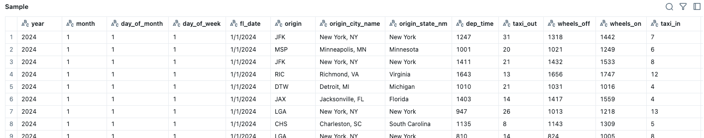
     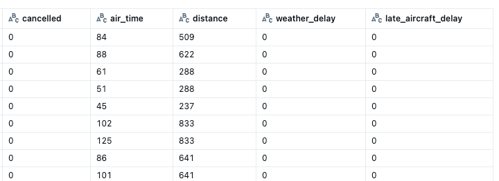
- Silver Layer Tables
  1. Enhanced data and additional columns.(silver_flights) 
     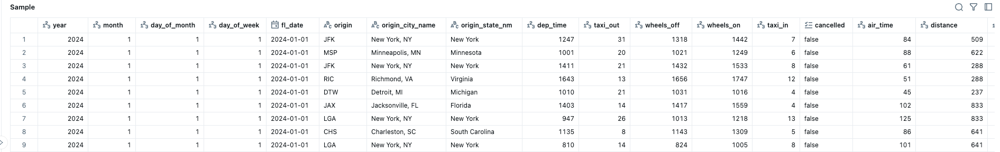
     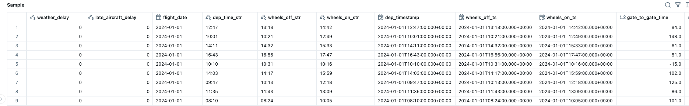
     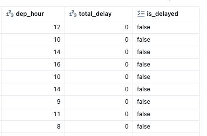
  2. Origin metrics table.(origin_metrics) 
     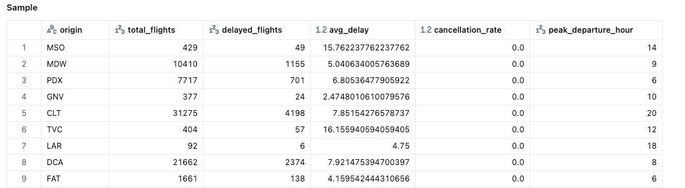
- Gold Layer Tables
  1. Date dimension.(dim_date) - Gold Layer
     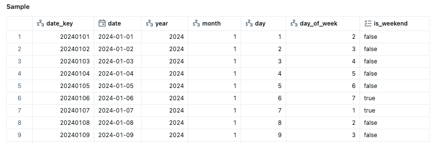
  2. Airport dimension.(dim_airport) \
     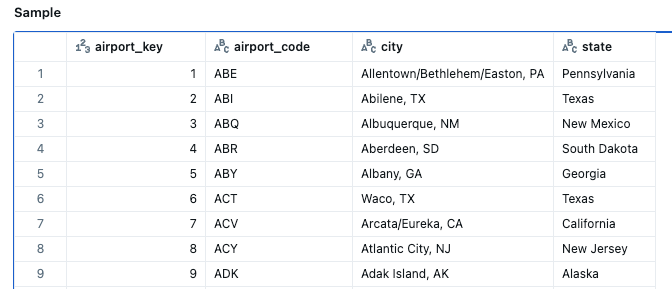
  3. Daily metric for flights at one airport.(fact_flights_daily)
     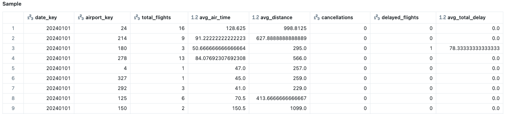
  4. Data regarding one flight.(fact_flights)
     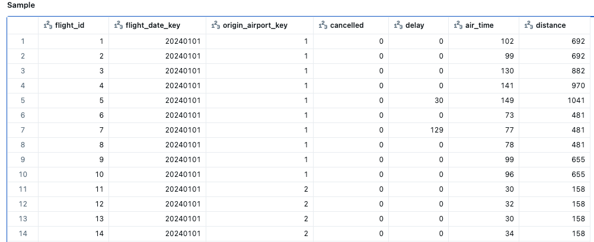
  5. Weekly data for airports.(gold_airport_metrics_weekly)
     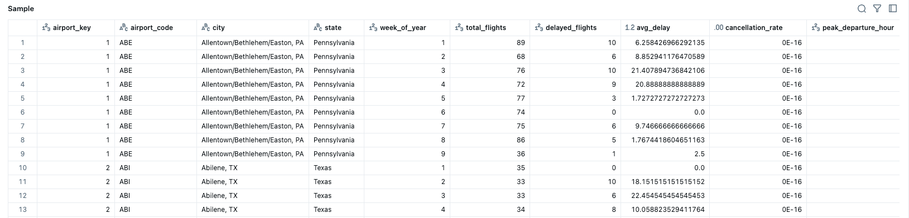
  6. High volume airports performance data.(gold_airport_perf_high_volume)
     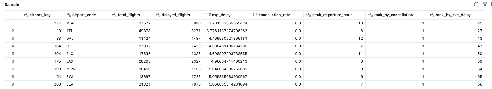
  7. Low volume airports performance data.(gold_airport_perf_low_volume)
      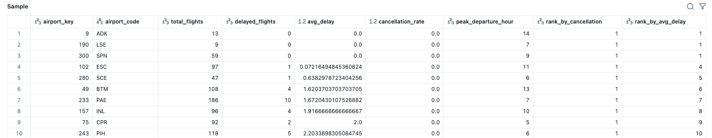

## Pipeline overview:

To build the ELT pipeline, a Databricks Job is created that orchestrates all layers of the Medallion Architecture: Bronze, Silver, and Gold in the correct execution order. Each notebook or workflow task corresponds to a transformation stage, and the tasks are chained together to ensure data flows consistently from raw ingestion to fully refined analytical tables.

The job can be executed manually or scheduled to run automatically.

### Job Scheduling

Within the Databricks Job settings:

* Schedules allow the pipeline to run at fixed intervals such as weekly or monthly, depending on the expected data arrival pattern.

* Triggers can also be configured, such as when a new file is uploaded in a volume. This enables event driven ingestion so the Bronze layer immediately processes new raw data.

* These options ensure the ELT pipeline remains automated, reliable, and aligned with data freshness requirements.

### Author: Tanvi Mehetre