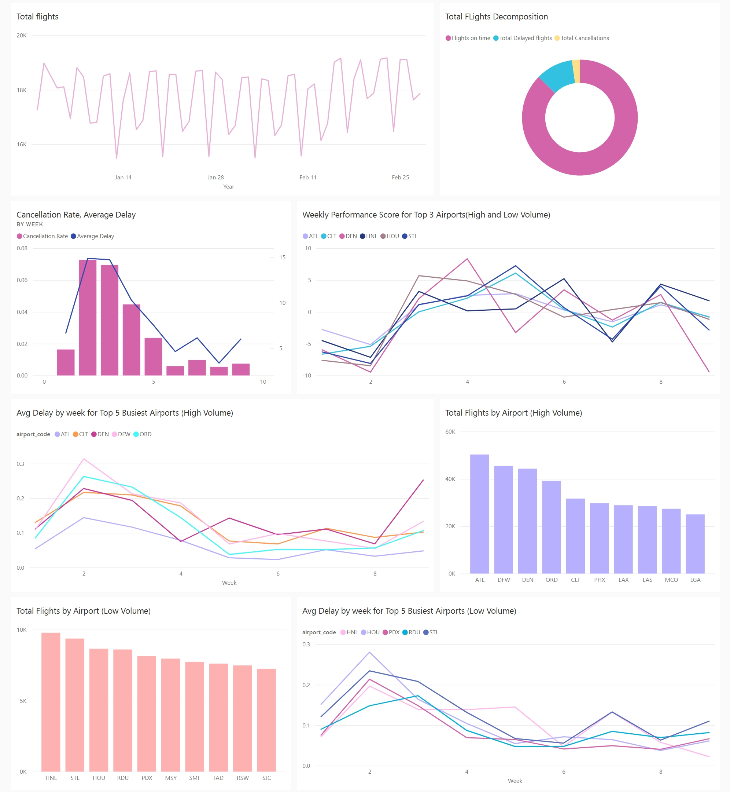

# Power BI - Reports and Dashboard

This project is the continuation of the Databrics - ELT pipeline. The data transformed and cleaned from the previous step is carried over. The goal is to create visualizations based on the data and analyze if to observe the trends over time for flight data in the United States for 2024.

## Power BI 

## Reports

- Three reports are created from the flight data from the previous steps as follows:
  1. Weekly Performance Report: This reports displays the overview for the total flights and delays over the time duration considered. It displays the trends in cancellation rate and average delay calculated previously. It also provides an overview of the delays and calculations in a tabular format. Weekly performance metric line graph provides an insight on how top 3 airports from high volume and low volume perform over time. \
     
  2. Top 10 Airports (Low Volume): This reports displays the total flights, cancellation rate of the top 10 airports from the data calculated in the gold layer in the previous task. A scatter plot displays how the total number of flights and average delay relate. A line chart with the average delay for top 5 busiest airports. Cards are displaying the top airports in terms of traffic, delays and cancellations. Low volume airports considered for this report have total traffic over 9 weeks to be lesser than 10,000. \
     
  3. Top 10 Airports (High Volume): This reports goes over the metrics for the total flights, cancellation rate, average delays and peak departure hours for the top 10 airports ranked by cancellation and average delays. High volume airports considered here have total traffic more than 10,000 over the course of 9 weeks. \
     

## Dashboards

- A dashboard gives an overview of the top metrics to analyze the data at a glance. The dashboard for this data has flights over the course of the time period considered. A donut chart to display the decomposition of the total flights in terms of on time, delayed and cancelled. The next visual displayed is of a bar chart comparing the cancellation rate and average delays over the weeks and a conclusion is derived on why the delays and cancellations are high during one particular time period. Weekly performance reports for 6 airports from top 3 airports for high volume and top 3 airports for low volume is displayed. Average delay rate over the weeks for top 5 airports from high volume and low volume are shown along with the total flights for the top 10 busiest airports in terms of high and low volume is also shown.
  

## PDF and Excel Reports

Built using the Power BI Report Builder. The reports display the total flight data over the week, data for the 30 airports for high volume and 100 airports for the low volume category. \
[Open PDF](Documents/Flights%20Metrics%20Report%20PDF.pdf) \
[Open Excel](Documents/Flight%20Metrics%20Excel.xlsx)
